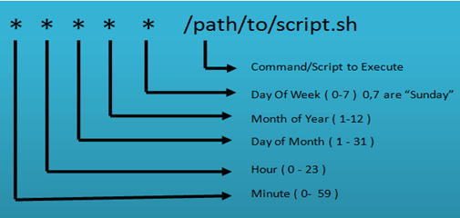

## crontab(cron table) Format

Q: How to run cron jobs sequencially & what is the impact of while loops in cron jobs

`MIN(0-59) HOUR(90-23) DayOfMonth(1-31) Month(1-12) DayOfWeek(0-6) CMD(Any command to be executed)`

`m h dom mon dow   command`

## Examples

`00 11, 16 * * * /home/maverick/bin/incremental-backup`: runs a backup script in the specified path every 11:00 and 16:00 on every day

`00 7, 17 * * * /scripts/script.sh`: runs everyday at 7AM & 5PM

`*/5 * * * * /scripts/script.sh:` runs every 5 minutes

`0 2 * * sat  [ $(date +%d) -le 06 ] && /script/script.sh:` runs on first Saturday of every month

**Viewing current crontab entries**: `crontab -l`

**Editing crontab:** `crontab -e`

**Removing crontab tasks:** `crontab -r`

## Crontab Special Keywords

- `@yearly:` 0 0 1 1 \*
- `@daily:` 0 0 \* \* \*
- `@hourly:` 0 \* \* \* \*
- `@reboot:` Run at startup

## Specifying Multiple Values in a Field

- The asterisk (\*) operator specifies all possible values for a field. e.g. every hour or every day.

- The comma (,) operator specifies a list of values, for example: "1,3,4,7,8".

- The dash (-) operator specifies a range of values, for example: "1-6", which is equivalent to "1,2,3,4,5,6".

- The slash (/) operator, can be used to skip a given number of values. For example, "_/3" in the hour time field is equivalent to "0,3,6,9,12,15,18,21"; "_" specifies 'every hour' but the "/3" means that only the first, fourth, seventh...and such values given by "\*" are used.
