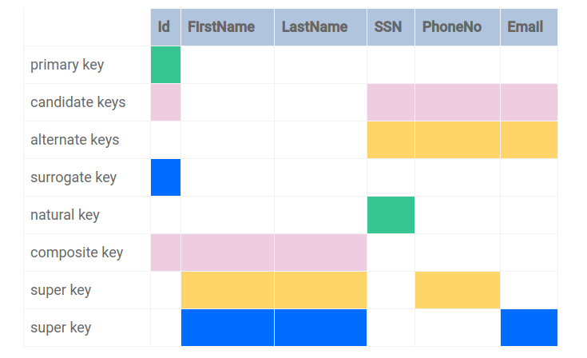

## Relational Database Keys

In a database, keys:

- Identify a particular row in a table, based on the data in one or more columns.
- Establish the relationship between two given tables using the foreign key concept.
- Enforce the identity and integrity of the database.

### Types of Database Keys

- **Primary key** - It is a column that uniquely identifies each row in a table.
- **Composite primary key** - It is a set of columns that together uniquely identify each row in a table.
- **Super key** - A group of single-column or composite keys that allow unique row identification.
- **Candidate key** - A set of of columns that can individually uniquely identify each row in atable. The primary key is selected from the candidate keys.
- **Alternate key** - One or more columns that uniquely identify each row in a table. The alternate key can be used as an alternative to the primary key.
- **Surrogate key** - Uniquely identifies each row in a table; this column is created specifically for the purpose of unique row identification. Primary key is mostly a surrogate key.
- **Natural key** - Same as a `surrogate key`, except it is part of the data set.
- **Foreign key** - Creates a link between two tables ad help maintain data integrity.

### Primary Key Rules

- Each primary key column value mus tbe unique; it cannot appear more than once in the column.
- Primary key is non-nullable.
