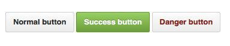

## BEM CSS

It's a CSS methodology that stands for: **Blocks, Elements and Modifiers**.

### Block

Standalone entity that is meaningful on its own.

**Examples:**

```HTML
header, container, menu, checkbox, input
```

### Element

A part of a block that has no standalone meaning and is essentially tied to its block.

**Examples:**

```HTML
menu item, list item, checkbox caption, header title
```

### Modifier

A flag on a block or element. Use them to change appearance or behavior.

**Examples:**

```HTML
disabled, highlighted, checked, fixed, size big, color yellow
```

Here is an example of how a button can be styled following the **BEM** methodology.

```HTML
<button class="button">
	Normal button
</button>
<button class="button button--state-success">
	Success button
</button>
<button class="button button--state-danger">
	Danger button
</button>
```

The CSS for the markup above is defined here.

```CSS
.button {
	display: inline-block;
	border-radius: 3px;
	padding: 7px 12px;
	border: 1px solid #D5D5D5;
	background-image: linear-gradient(#EEE, #DDD);
	font: 700 13px/18px Helvetica, arial;
}
.button--state-success {
	color: #FFF;
	background: #569E3D linear-gradient(#79D858, #569E3D) repeat-x;
	border-color: #4A993E;
}
.button--state-danger {
	color: #900;
}
```

And the resulting button looks like this.



### Benefits of BEM

- Modularity - Block styles are never dependent on other elements on the page, so you will never experience problems from cascading.
- Reusability - Composing independent blocks in different ways, and reusing them intelligently, reduces the amount of CSS code that you will have to maintain. With a set of style guidelines in place, you can build a library of blocks, making your CSS super effective.
- Structure - BEM methodology gives your CSS code a solid structure that remains simple and easy to understand.
