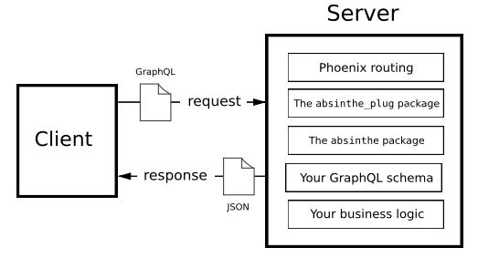

## Absinthe and the Tech Stack

This is a tool specifically for Elixir's implementation of GraphQL. For intro notes on GraphQL, refer to [this](Introduction.md) tool.

At a high-level, this is how a GraphQL request is handled, in Elixir-world:



### Providing Field Argument Values

There are two ways that a GraphQL user can provide values for an argument: as document literals, and as variables.

**Using Literals**

```GraphQL
{
    menuItems(matching: "reu") {
        name
    }
}
```

**Using Variables**

GraphQL variables act as typed placeholders for values that will be sent along with the request.

GraphQL variables are declared with their types, before they are used, alongside the operation type.

```GraphQL
query ($term: String) {
    menuItems(matching: $term) {
        name
    }
}
```

**Using Enumeration Types**

A GraphQL enumeration is a special type of scalar that has a defined, finite set of possible values.

Examples:

- Available shirt sizes: S, M, L and XL,
- Color components: RED, BLUE, and GREEN
- Ordering: ASC and DESC

### Mutations

**Defining a Root Mutation Type**

To support mutation operations, we need to define a root mutation type, just as we did for queries. This will be used as the entry point for GraphQL mutation operations, and it will define--based on the mutation fields that we add--the complete list of capabilities that the users of our API will have available to modify data.

To create menu items, we'll need to accept information from the client. We'll use an input object to model the data that we will be expecting.

Mutation example:

```GraphQL
mutation CreateMenuItem($menuItem: MenuItemInput!) {
    createMenuItem(input: $menuItem) {
        id
        name
        description
        price
        category { name }
        tags { name }
    }
}
```

### Retrieving multiple data at once using the same fields

Imagine you wanted to search for two meals, one "inHand" and another "inGlass". You can issue one GraphQL document, with aliases and you'll get the data in one request. Here's how you can achieve that.

**GraphQL document**:

```GraphQL
query Meal {
    inHand: search(matching: "reu") { name }
    inGlass: search(matching: "lem") { name }
}
```

**API response**:

```JSON
{
    "data": {
        "inHand": [
            {
                "name": "Reuben"
            }
        ],
        "inGlass": [
            {
                "name": "Lemonade"
            }
        ]
    }
}
```

### Handling Mutation Errors

There are two approaches that you can use in your Absinthe schema to give users more information when they encounter an error: using simple `:error` tuples, and, modelling the errors directly as types.

**Using Tuples**

Here's an example of a resolver function that uses tuples to handle errors:

```Elixir
def create_item(_, %{input: params}, _) do
    case Menu.create_item(params) do
      {:ok, item} ->
        {:ok, item}

      {:error, changeset} ->
        {:error, message: "Could not create menu item", details: error_details(changeset)}
    end
  end

  defp error_details(changeset) do
    Ecto.Changeset.traverse_errors(changeset, fn {msg, _opts} -> msg end)
  end
```

Here's how the return value of the resolver function would look like in case of an error:

```Elixir
{
    :error,
    message: "Could not create menu item",
    details: %{
        "name" => ["has already been taken"]
    }
}
```

And, here is the serialized API response:

```JSON
{
    "data": {
        "createMenuItem": null
    },
    "errors": [
        {
            "message": "Could not create menu item",
            "details": {
                "name": ["has already been taken"]
            },
            "locations": [{"line": 2, "column": 0}],
            "path": [
                "createMenuItem"
            ]
        }
    ]
}
```

**NOTE:** Errors are reported separate of data values in a GraphQL response.

**Errors as data**

We can define the structure of our errors as normal types, so that we support introspection and enable better integration with clients.

An example of a GraphQL document that has errors as type is shown below.

```GraphQL
mutation ($menuItem: MenuItemInput!) {
    createMenuItem(input: $menuItem) {
        errors {
            key
            message
        }
        menuItem {
            name
            description
            price
        }
    }
}
```

When clients receive responses for this document, they can intepret the success of the result by checking the value of `menuItem` and/or `errors`, then give feedback to users appropriately.

Here's an example API response incase of an error.

```JSON
{
    "data": {
        "createMenuItem": {
            "errors": [
                { "key": "name", "message": "has already been taken" }
            ],
            "menuItem": nil
        }
    }
}
```

### Understanding Abstract Types

These types give you the flexibility to resolve API client requests that do not point to an exact schema type, like searching for data that can be found across multiple database tables.

GraphQL specification gives two ways to work with abstract types: unions and interfaces.

**Unions**

This is an abstract type that represents a set of specific concrete types. For instance, in a search example, a `:search_result` could be a union for both `:menu_item` and `:category`.

Since API response resulting from unions may be coming from different sources (database tables) you may want to know which pieces of data belong to which source. `__typename` is a GraphQL's built-in introspection field that returns the concrete GraphQL type for the surrounding scope of data.

**Interfaces**

GraphQL interfaces are similar to unions, with one key difference: they add a requirement that any member types must define a set of included fields.

### Using fragments

Named fragments are just like inline fragments, but they're reusable.

Example:

```GraphQL
query Search($term: String!) {
    search(matching: $term) {
        ... MenuItemFields
        ... CategoryFields
    }
}

fragment MenuItemFields on MenuItem {
    name
}

fragment CategoryFields on Category {
    name
    items {
        ... MenuItemFields
    }
}
```
