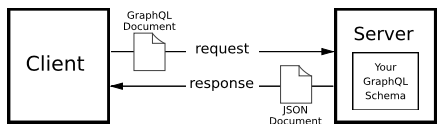
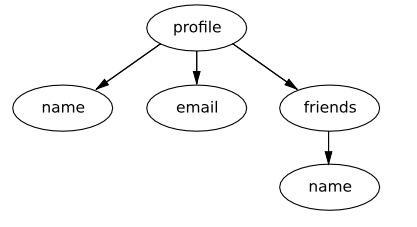

## GraphQL

GraphQL is a query language for APIs, and a server side runtime for executing queries using a type system you define for your data.

A GraphQL service is created by defining types and fields on those types, then providing functions for each field on each type. For example, a GraphQL service that tells you who the logged in user is (me) as well as that user's name might look like this:

```JS
type Query {
    me: User
}

type User {
    id: ID
    name: String
}
```

Along with functions for each field on each type:

```JS
function Query_me(request) {
    return request.auth.user

}

function User_id(user) {
    return user.getId()
}

function User_name(user) {
    return user.getName()
}

```

**How GraphQL works on the high-level**

Let's imagine how a web or mobile application might request data from a server over HTTP. At a high-level, this conversation looks something like the image below.

The application sends a GraphQL document to the server, and the server responds with JSON document, having consulted a schema that describes data it has available to query and to modify. Because of the schema, the server is empowered to flexibly fulfill the requests sent by clients on a case-by-case basis.



Let’s see how this compares to REST, looking at a specific example: retrieving information about a specific user record. In a REST API, we’d do an HTTP request that would look something like this (assuming a user ID of 123):

```cURL
GET /users/123
```

As a client of this REST API, you have very limited control over what is returned. The contract between the client and the server is fairly one-sided; the client gets what the server wants to give it.

In GraphQL world, if a client wants to retrieve a user's name and email, they would send the following GraphQL document:

```GraphQL
{
    user(ID: 123) {
        name
        email
    }
}
```

which would return only the requested fields.

```JSON
{
    "data": {
        "user": {
            "name": "John Doe",
            "email": "john@doe.com"
        }
    }
}
```

A similar REST API would probably return a complete user data (with other related data like profile, favourites, etc), depending on how the server has defined the data; there's little-to-no flexibility in REST API world.

### Including Relationships

GraphQL greatly simplifies querying data across relationships. Here's an example that fetches user's data, together with their friends' data:

```GraphQL
{
    user(id: 123) {
        name
        email
        friends {
            name
        }
    }
}
```

The result is much as it was with our earlier user example, but with the additional data about friends a level deeper:

```JSON
{
    "data": {
        "user": {
            "name": "Joe Bob",
            "email": "joe.bob@example.com",
            "friends": [
                {"name": "Fred Jones"},
                {"name": "Jane Smith"},
                {"name": "Rebekah Jones"}
            ]
        }
    }
}
```

### GraphQL on the server

GraphQL query documents can be flexible because the server holds a complete schema describing the shape of the data that the API models and the input that it can expect from clients.

This means that you, as the API developer, are responsible for accurately building a representation of your data.

**GraphQL Inputs**

With GraphQL, you have a predefined schema with declared types and rules about the input that you can receive from users to retrieve data. This helps in input data validation so that, as the API developer, you don't have to do that manually. When someone sends you data, it is checked against these rules before your code is executed.

Typically, an object type will reside in its own table in the database.

If the client sends something extra, or fails to send some required data, or if they send invalid data, they'll be given detailed error message in the API response, to that effect.

**Queries and Schemas**

- **Object types:** GraphQL types that represent complex values which have fields, like a `User`.
- **Scalar types:** types that represent simple values that don't have fields, like `String`, `Int`.

GraphQL's type system models a number of different types and defines a number of ready-to-use built-in types.

Object types can have fields that point to themselves, like a `Friends` type, which is really a `User` type.

Incoming queries are matched up against the schema. A visual representation of the following relation is shown below.

```GraphQL
{
    profile {
        name
        email
        friends {
            name
        }
    }
}
```



**Note:** Building a schema presents two major categories of work: describing the types and the edges between types (both by defining them and adding built-in documentation), and writing the business logic that edges use to find their data.

### Passing arguments to GraphQL Document

The equivalent of REST API's params (query params, POST body, etc) in GraphQL can be passed in this way:

```GraphQL
{
    user(id: 123) {
        name
        email
        friends {
            name
        }
    }
}
```

Where `user` takes an `id` as argument.

You can also use variables to pass arguments.

First, you update your schema's query with the variable you expect.

```Elixir
query do
    field :menu_items, list_of(:menu_item) do
      arg(:matching, :string)
      arg(:order, :sort_order, default_value: :asc)

      resolve(&MenuResolver.menu_items/3)
    end
end
```

`:matching` and `:order` are the variables that are currently accepted. `:order` is of `:sort_order` type, which is an enum type.

```Elixir
enum :sort_order do
    value(:asc)
    value(:desc)
end
```

The API is now able to handle requests that have variables.

```GraphQL
query ($match: String, $order: SortOrder) {
  menuItems(matching: $match, order: $order) {
    description
    name
  }
}
```

Result:

```GraphQL
{
  "data": {
    "menuItems": [
      {
        "description": "Sample description",
        "name": "sample 1"
      }
    ]
  }
}
```

> The client can enforce that certain variables are required by adding a `!` at the end of the variable type, like `SortOrder!`.

> Enforcement can also be done on the server, by adding non-null constraints to the argument/variable types.

**Example:**

```Elixir
query do
    field :menu_items, list_of(:menu_item) do
        arg(:filter, non_null(:menu_item))
    end
end
```

### Input Objects

Field arguments can be organized into groups using a mechanism called **input object types**. This object type exists just for argument types, making it easy to handle and organize an arbitrary number of arguments that our API clients can issue. See example below:

```GraphQL
@desc "Filtering options for the menu item list"
  input_object :menu_item_filter do
    @desc "Matching a name"
    field :name, :string

    @desc "Matching a category name"
    field :category, :string

    @desc "Matching a tag"
    field :tag, :string

    @desc "Priced above a value"
    field :priced_above, :float

    @desc "Priced below a value"
    field :priced_below, :float
  end
```

### Custom Scalar types

Custom scalar types are created in this way (assume we're creating a `date` scalar type):

```Elixir
scalar :date do
    parse fn input ->
        # Parsing logic here
    end

    serialize fn date ->
        # Serialization logic here
    end
end
```

Each scalar needs to have two parts defined for it - a parse function and a serialize function:

- `parse` converts a value coming from the user into an Elixir term (or returns `:error`).
- `serialize` converts an Elixir term back into a value that can be returned via JSON.

Here is a complete example:

```Elixir
scalar :date do
    parse fn input ->
        case Date.from_iso8601(input.value) do
            {:ok, date} ->
                {:ok, date}
            _other ->
                :error
        end
    end

    serialize fn date ->
        Date.to_iso8601(date)
    end
end
```
